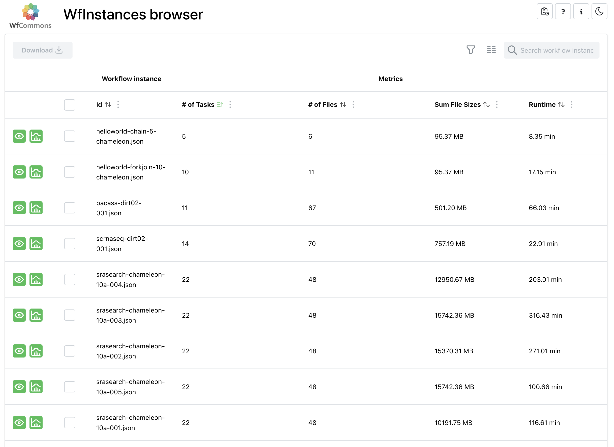

[](https://doi.org/10.5281/zenodo.12510982)&nbsp;&nbsp;
&nbsp;&nbsp;
[](https://github.com/wfcommons/wfinstances/releases)&nbsp;&nbsp;
[](LICENSE)

<a href="https://wfcommons.org" target="_blank"></a>

# WfInstances

Collection and curation of open access production workflow executions from various
scientific applications. These _workflow instances_ are described using
[WfFormat](https://github.com/wfcommons/WfFormat), the JSON format used across the
[WfCommons](https://wfcommons.org) ecosystem.

Each instance is a single JSON file that captures **one real execution** of a
workflow: its task graph, the input/output files of every task, and the measured
per-task performance (runtime, CPU, memory, I/O) along with the machines the tasks
ran on. Instances can be used as-is for simulation and scheduling research, or as
input for generating realistic synthetic workflows.

## Contents

| Runtime system | Directory | Applications |
| --- | --- | --- |
| [Makeflow](https://ccl.cse.nd.edu/software/makeflow/) | [`makeflow/`](./makeflow) | BLAST, BWA |
| [Nextflow](https://nextflow.io) | [`nextflow/`](./nextflow) | [nf-core](https://nf-co.re) pipelines (incl. Sarek and RNA-Seq campaigns) |
| [Pegasus](http://pegasus.isi.edu) | [`pegasus/`](./pegasus) | 1000Genome, Cycles, Epigenomics, Montage, Seismology, SoyKB, SRA Search |
| [Snakemake](https://snakemake.readthedocs.io) | [`snakemake/`](./snakemake) | RASflow, rna-seq-star-deseq2, Varlociraptor |
| [StreamFlow](https://streamflow.di.unito.it/) | [`streamflow/`](./streamflow) | 1000Genome (CWL) |
| synthetic | [`helloworld/`](./helloworld) | chain and fork-join test patterns |

Every runtime-system directory has its own README describing the applications, the
file naming convention, and how the instances were obtained. The
[browser web application](https://wfinstances.ics.hawaii.edu) is the easiest way to
see what is currently available.

## WfInstances browser web application

A [WfFormat WfInstances browser web application](https://wfinstances.ics.hawaii.edu)
is available to easily browse, filter, and visualize the instances available in this
repository.

<a href="https://wfinstances.ics.hawaii.edu" target="_blank"></a>


## Repository organization

```
<runtime-system>/            e.g. pegasus/, nextflow/, snakemake/
├── README.md                applications, provenance, and summary of instances
└── <application>/           e.g. pegasus/montage/
    ├── README.md            workflow description, structure, naming convention
    ├── docs/images/         workflow structure figure
    └── *.json               one WfFormat file per execution instance
```

Instance file names encode the execution parameters that drive the size and shape
of the workflow (e.g., `montage-chameleon-2mass-10d-001.json` is a Montage run on
[Chameleon](https://www.chameleoncloud.org) over the 2MASS survey with a 10-degree
mosaic). The exact convention is documented in each application README.

## Using the instances

Instances are plain JSON files, so they can be downloaded directly from GitHub, e.g.:

```bash
curl -O https://raw.githubusercontent.com/wfcommons/WfInstances/main/pegasus/montage/montage-chameleon-2mass-10d-001.json
```

They can be loaded and analyzed with the
[WfCommons Python package](https://github.com/wfcommons/wfcommons):

```python
import pathlib
from wfcommons import Instance

instance = Instance(input_instance=pathlib.Path("pegasus/montage/montage-chameleon-2mass-10d-001.json"))
instance.draw(extension="png")
```

They are also directly consumable by any
[simulation framework](https://wfcommons.org/simulation) that implements WfFormat,
and are used by
[WfChef/WfGen](https://wfcommons.readthedocs.io/en/latest/generating_workflows.html)
to produce synthetic — yet realistic — workflows of arbitrary size.

## Instance format and validation

All instances in this repository conform to **WfFormat 1.6**. The
[Build](https://github.com/wfcommons/WfInstances/actions) workflow validates *every*
JSON file in the repository against the WfFormat schema on each push, using the
validator from the [WfFormat repository](https://github.com/wfcommons/WfFormat):

```bash
git clone https://github.com/wfcommons/wfformat
python3 ./wfformat/wfcommons-validator.py -d path/to/instance.json
```

Please run the validator locally before opening a pull request.

## Contributing

Contributions of new execution instances are welcome. In short:

1. Produce a WfFormat instance from your execution logs — the WfCommons Python
   package ships parsers for Pegasus, Makeflow, Nextflow, Snakemake, and
   RO-Crate-based systems (see the
   [instance analysis documentation](https://wfcommons.readthedocs.io/en/latest/analyzing_instances.html)).
2. Place the file under `<runtime-system>/<application>/`, following the naming
   convention used by the sibling instances, and add or update the application
   README (workflow description, structure, and instance table).
3. Validate the file against the WfFormat schema, then open a pull request.

Bug reports and questions:
[GitHub Issues](https://github.com/wfcommons/WfInstances/issues) or
[support@wfcommons.org](mailto:support@wfcommons.org).

## Citing

If you use these instances in your research, please cite this repository via its DOI
([10.5281/zenodo.12510982](https://doi.org/10.5281/zenodo.12510982)) and the
WfCommons framework paper:

```bibtex
@article{wfcommons,
    title   = {{WfCommons: A Framework for Enabling Scientific Workflow Research and Development}},
    author  = {Coleman, Taina and Casanova, Henri and Pottier, Loic and Kaushik, Manav and Deelman, Ewa and Ferreira da Silva, Rafael},
    journal = {Future Generation Computer Systems},
    volume  = {128},
    pages   = {16--27},
    doi     = {10.1016/j.future.2021.09.043},
    year    = {2022}
}
```

Several applications also have their own reference publication, listed in the
corresponding application README. A full list of WfCommons publications is available
at [wfcommons.org/publications](https://wfcommons.org/publications).

## License

This repository is licensed under the terms of the
[GNU Lesser General Public License v3.0](LICENSE).
